# ATmega128 POV Display — 회전 LED 잔상 디스플레이

> 마이크로프로세서 수업 Term Project · **2025.08 – 2025.11** · 4인 팀 (팀장) — 회로·PCB·펌웨어·기구 설계 전담

## 프로젝트 개요

| | |
|---|---|
| **소개** | 세로 한 줄로 배치한 **RGB LED 16개**를 모터로 회전시키고, 회전에 맞춰 열(column) 데이터를 빠르게 바꿔 **잔상(POV)으로 글자와 그림을 공중에 그리는** 디스플레이. LED 구동 PCB 설계 → 펌웨어 → 3D 프린팅 기구까지 직접 구현했습니다. |
| **기획 의도** | LED 16개는 그 자체로는 세로 **선** 하나에 불과합니다. 하지만 이 선을 회전시키면서 정확한 타이밍에 빛을 바꾸면, 사람 눈의 잔상 효과로 선이 지나간 자리가 **면**이 되어 글자와 그림이 떠오릅니다. **부품 수를 늘리는 대신 시간으로 해상도를 만든다**는 발상에 끌려 주제로 골랐습니다.<br><br>같은 발상을 배선에도 적용했습니다. RGB LED 16개를 직접 제어하려면 핀이 48개 필요하지만, 시프트 레지스터 6개를 한 줄로 엮어 데이터를 직렬로 흘려보내면 **핀 3개면 충분합니다.** 수업에서 배운 ATmega128의 **타이머 · PWM · 외부 인터럽트 · GPIO 제어**를 이 하나의 작품에 통합했고, 이전 프로젝트에서 겪은 만능기판 배선의 한계를 넘기 위해 **KiCad로 PCB를 직접 설계**했습니다. |
| **하이라이트** | 🔆 **선 → 면** : LED 한 줄(16개)을 회전시켜 잔상으로 2차원 화면 구현<br>📌 **48 → 3** : 74HC595 체인으로 LED 48채널을 MCU 핀 3개로 제어<br>🎨 **단색 8행 → RGB 16행** : 해상도 2배, 6색 · 6단계 밝기 표현 |
| **내 역할** | **팀장** — 회로 설계, PCB 아트웍·제작, 펌웨어(LED 보드 · 모터 보드), 기구 3D 모델링, 설계 문서 |
| **기여도** | **90%** — 하드웨어·펌웨어·기구 설계를 사실상 단독으로 구현 (자세한 내용은 [내 담당 범위](#내-담당-범위)) |

## 주요 사양

| 항목 | 내용 |
|---|---|
| MCU | ATmega128 × 2 (LED 보드 / 모터 보드) |
| LED | RGB LED 16개 (16행 × R·G·B = 48채널) |
| LED 드라이버 | 74HC595 ×6 데이지 체인 (48비트) — **MCU 핀 3개로 48채널 구동** |
| 모터 | DC 모터 + L298N 모터 드라이버, Timer0 Fast PWM 속도 제어 |
| 입력 | 택트 스위치 → 외부 인터럽트 (LED 4개 + 모터 3개) |
| 기능 | 6색 전환 · 6단계 밝기 · 패턴 2종(글자 `ISA` / 하트) · 모터 속도 ±, 일시정지 |
| 개발 환경 | CodeVisionAVR (C), KiCad 9, Fusion 360 |
| 상태 | **완료** — 2025.08 – 2025.11 마이크로프로세서 수업 텀프로젝트 (이후 추가 개발 없음) |

<p align="center">
  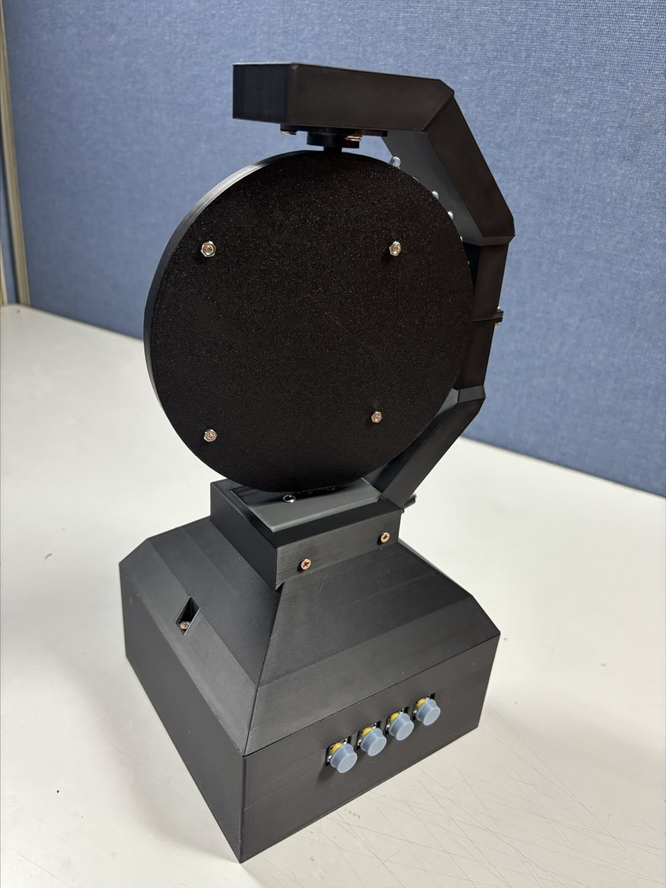
  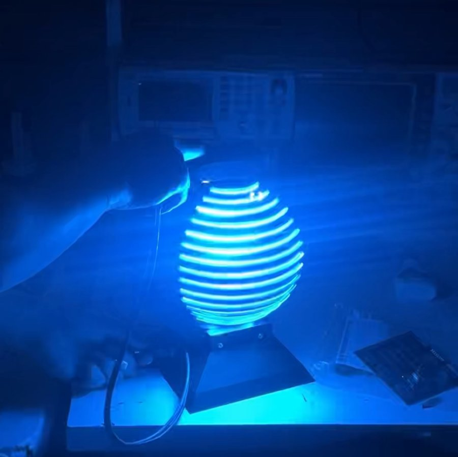
  <br><sub>왼쪽 완성품 · 오른쪽 회전 중 잔상 — LED 한 줄이 회전하며 구(球) 형태의 면을 만듦</sub>
</p>

---

## 시스템 구조

<p align="center">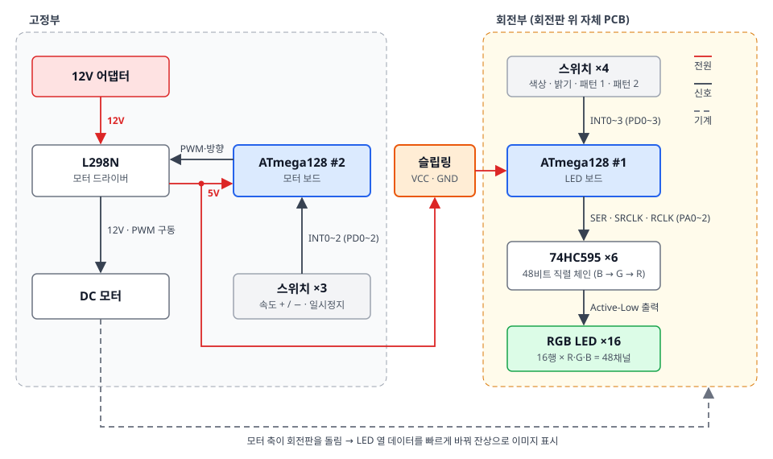</p>

- **고정부**: 12V 어댑터 → L298N이 모터를 구동하고, L298N의 5V 출력으로 모터 보드와 회전부에 전원 공급
- **회전부**: 전원은 **슬립링**을 통해 회전판 위 LED 보드로 전달되며, MCU가 74HC595 체인으로 RGB LED 16개를 구동

### 동작 원리

1. **LED 한 열 출력** — 16비트 열 패턴을 색상에 따라 R/G/B 채널에 배치하고, B → G → R 순서로 48비트를 시프트한 뒤 RCLK로 한 번에 래치
   - 비트가 `0`이면 LED 켜짐(Active-Low), `0xFFFF`는 전체 소등
2. **밝기 (소프트웨어 PWM)** — 한 열을 `uptime` ms 동안 켜고 `7 - uptime` ms 동안 꺼서, 7 ms 주기 안에서 듀티비를 1/7 ~ 6/7로 조절
3. **패턴** — 회전하는 동안 열 데이터를 순서대로 바꿔 출력하면 잔상으로 2차원 이미지가 보임
   - `ISA` 글자: 24열 (글자당 8열), 하트: 12열
4. **모터 속도** — Timer0 Fast PWM의 `OCR0` 값(0~254)을 인터럽트로 ±10씩 바꿔 L298N ENA에 입력

### 제어 흐름

<p align="center">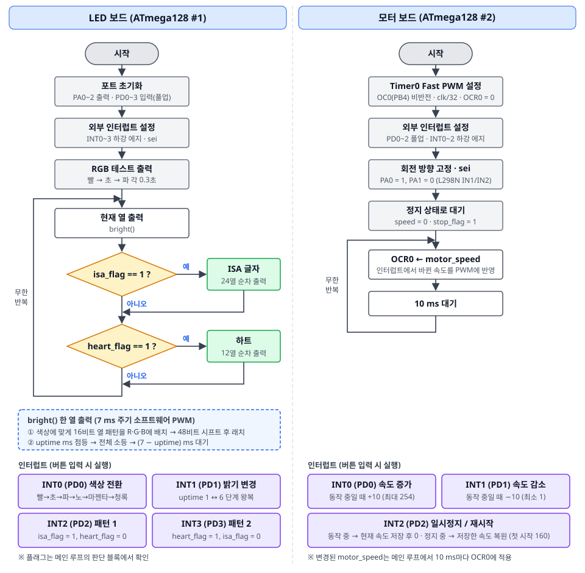</p>

### 핀 배치

**LED 보드 (ATmega128 #1)**

| 핀 | 방향 | 용도 |
|---|---|---|
| PA0 | 출력 | 74HC595 SER / DS (직렬 데이터) |
| PA1 | 출력 | 74HC595 SRCLK / SHCP (시프트 클럭) |
| PA2 | 출력 | 74HC595 RCLK / STCP (래치 클럭) |
| PD0 (INT0) | 입력, 풀업 | 색상 전환 (빨 → 초 → 파 → 노 → 마젠타 → 청록) |
| PD1 (INT1) | 입력, 풀업 | 밝기 변경 (1 ↔ 6 단계 왕복) |
| PD2 (INT2) | 입력, 풀업 | 패턴 1: `ISA` 글자 |
| PD3 (INT3) | 입력, 풀업 | 패턴 2: 하트 |

**모터 보드 (ATmega128 #2)**

| 핀 | 방향 | 용도 |
|---|---|---|
| PB4 (OC0) | 출력 | PWM → L298N ENA |
| PA0 / PA1 | 출력 | L298N IN1 / IN2 (회전 방향 고정) |
| PD0 (INT0) | 입력, 풀업 | 속도 +10 (최대 254) |
| PD1 (INT1) | 입력, 풀업 | 속도 −10 (최소 1) |
| PD2 (INT2) | 입력, 풀업 | 일시정지 / 재시작 (직전 속도 복원, 첫 시작 160) |

인터럽트는 모두 하강 에지 트리거(`EICRA`)입니다.

---

## 폴더 구조

```
atmega128-pov-display/
├─ firmware/                  CodeVisionAVR C 소스
│  ├─ led_board/main.c        74HC595 48비트 시프트 출력, 색상·밝기·패턴 제어
│  └─ motor_board/main.c      Timer0 Fast PWM 모터 속도 제어
├─ hardware/
│  └─ pcb/                    KiCad 9 프로젝트 (LED 보드)
│     ├─ MPMP.kicad_pro / .kicad_sch / .kicad_pcb
│     └─ gerber/              제작용 Gerber + 드릴 파일
├─ mechanical/                3D 프린팅 부품 (STL)
│  ├─ rotor_plate.stl         회전판 (PCB 장착)
│  ├─ rotor_cover_v2.stl      회전판 덮개
│  ├─ support_upper.stl       지지대 (위)
│  ├─ support_lower.stl       지지대 (아래)
│  ├─ base.stl                받침대
│  └─ base_support.stl        받침대 하부 받침
└─ docs/
   ├─ images/                 블록 다이어그램, 플로우차트, PCB · 3D · 결과 사진
   └─ videos/                 동작 영상
```

---

## 하드웨어

### LED 보드 PCB

- **크기**: 90.3 × 87.2 mm, 2층, 두께 1.6 mm (KiCad 9)
- **구성**
  - ATmega128-16A (TQFP-64) + 크리스털, 22 pF 부하 커패시터, 리셋 스위치
  - 74HC595 × 6 (R·G·B 각 2개, 채널당 16비트) + 칩별 0.1 µF 바이패스 커패시터
  - 8연 저항 네트워크(R_Network08) × 2
  - LED 연결 패드 48개 (R/G/B × 16), 10핀 ISP 헤더 (PE0 / PE1 / PB1 / RESET)
  - 고정용 마운팅 홀 4개
- 48채널 LED 배선을 회전체에 싣기 위해 MCU와 시프트 레지스터를 한 장의 보드로 통합

| PCB 레이아웃 | PCB 3D 뷰 | 회전판 조립 (LED 48채널 배선) |
|:---:|:---:|:---:|
| 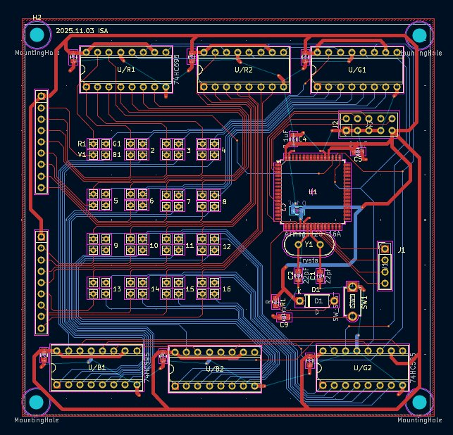 | 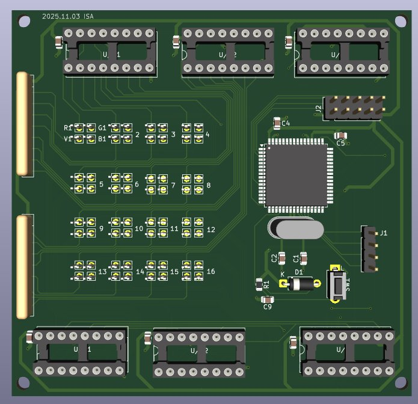 | 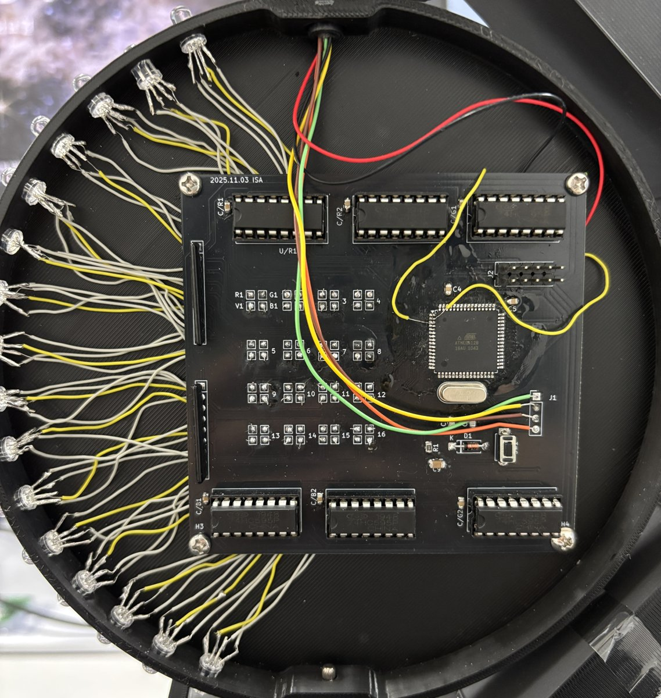 |

브레드보드 테스트를 거친 뒤 PCB로 제작했습니다 ([브레드보드 사진](docs/images/breadboard.jpg)).

### 기구부

- 회전판에 PCB와 LED를 고정하고, 모터 축에 연결해 회전
- 지지대(위/아래)와 받침대로 모터와 회전부를 고정
- 회전부 전원은 슬립링을 통해 공급 (회전하는 LED 보드에 VCC · GND 전달)

| 회전판 · 덮개 | 지지대 · 받침대 | 최종 조립 모델 |
|:---:|:---:|:---:|
| 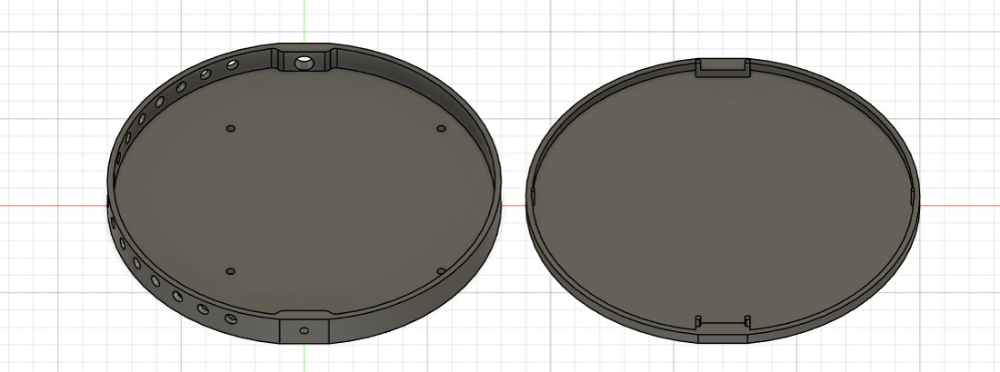 | 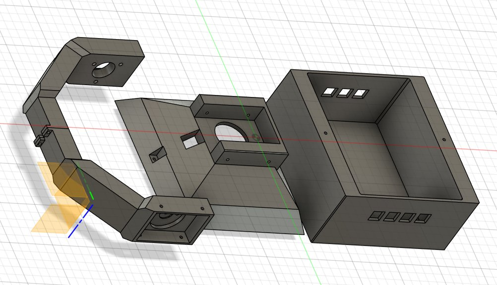 | 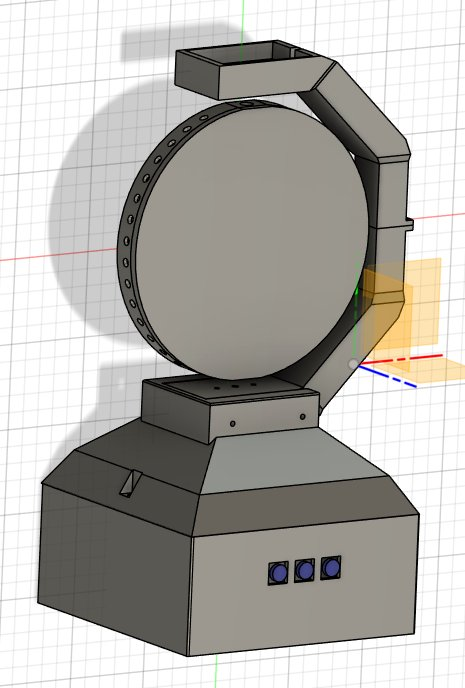 |

---

## 결과

### RGB 출력

| Red | Green | Blue |
|:---:|:---:|:---:|
| 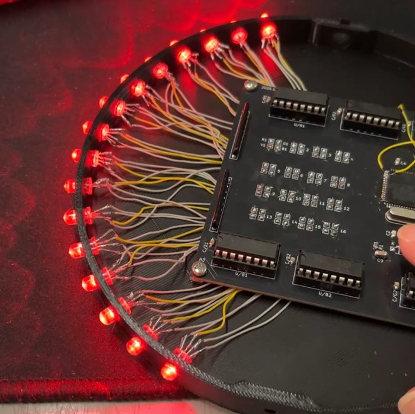 | 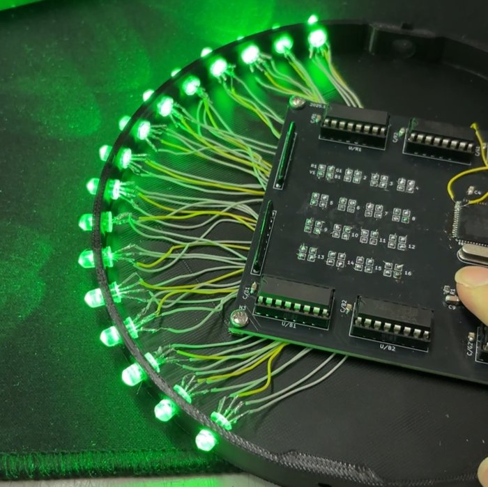 | 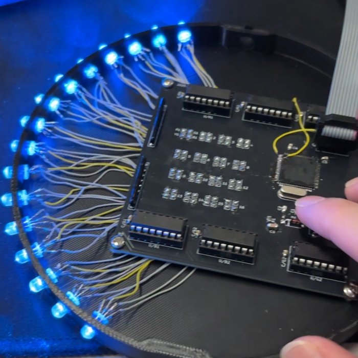 |

### 잔상으로 글자 출력 (`ISA`)

| I | S | A |
|:---:|:---:|:---:|
| 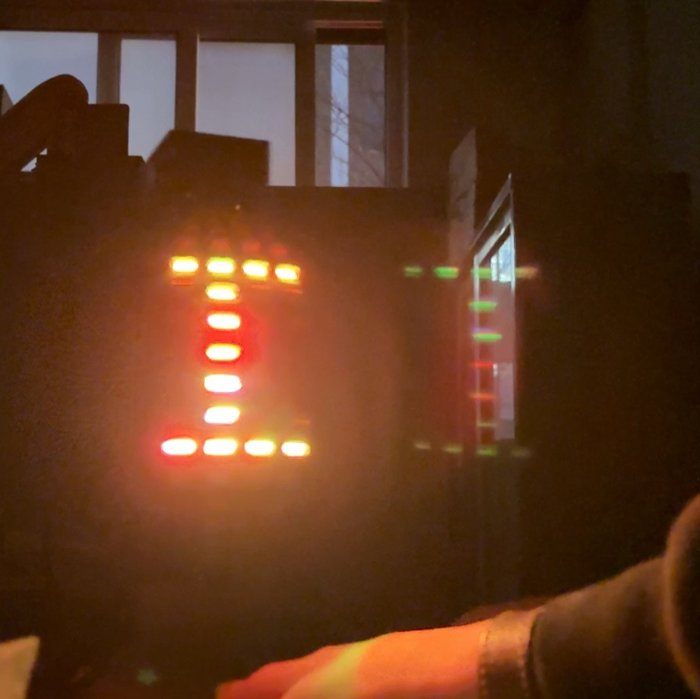 | 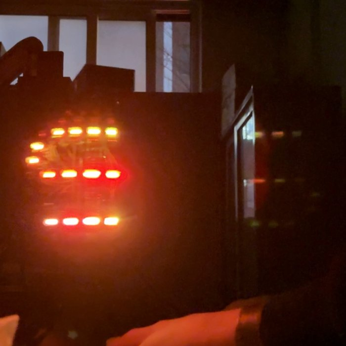 | 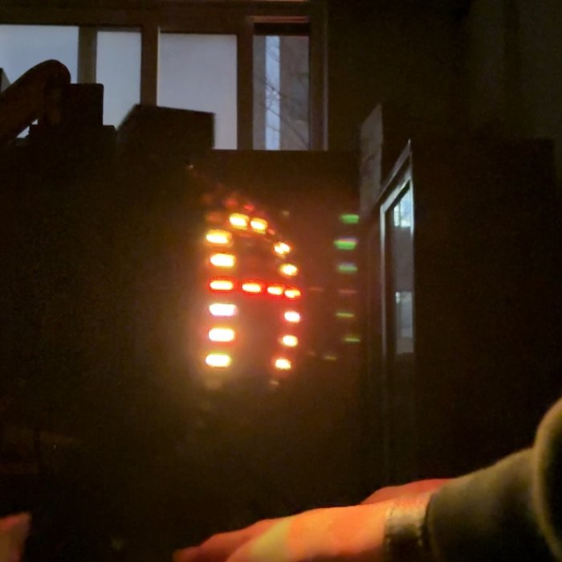 |

### 동작 영상

<a href="docs/videos/pattern_demo.mp4">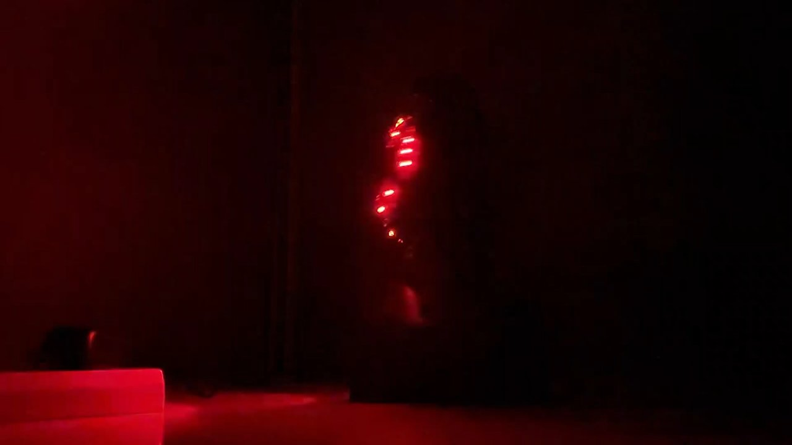</a>

▶ [`docs/videos/pattern_demo.mp4`](docs/videos/pattern_demo.mp4) — 회전하며 패턴을 출력하는 모습

---

## 내 담당 범위

4인 팀 프로젝트에서 제가 담당한 부분입니다.

| 파트 | 내용 |
|---|---|
| 회로 / PCB | LED 보드 회로도 설계, PCB 아트웍, Gerber 출력 및 제작 |
| 펌웨어 | LED 보드(시프트 레지스터 구동, 색상·밝기·패턴 제어), 모터 보드(PWM 속도 제어) |
| 기구 | 회전판, 덮개, 지지대, 받침대 3D 모델링 및 출력 |
| 설계 문서 | 블록 다이어그램, 제어 플로우차트, 핀 배치 |

---

## 트러블슈팅

### 1. RGB · 16행으로 확장하자 GPIO가 부족해진 문제
- **배경**: 처음에는 단색 LED 8개(8행)로 설계했으나, 두 가지를 바꾸기로 함
  - 한 가지 색으로 고정된 표현이 아쉬워 **RGB LED**로 변경 → 여러 색상 표현
  - 글자와 그림을 더 선명하게 표시하기 위해 **8행 → 16행**으로 해상도 확장
- **문제**: RGB LED 16개를 GPIO로 직접 제어하면 16행 × R·G·B 3색 = **48핀**이 필요 (단색 8행일 때는 8핀) → ATmega128 포트 대부분을 LED에만 써야 해서 버튼 인터럽트 등 다른 기능에 쓸 핀이 부족
- **해결**: 74HC595 시프트 레지스터 6개를 직렬로 연결해 48비트를 직렬로 전송하고 래치로 한 번에 출력
  - MCU 핀 **3개**(SER · SRCLK · RCLK = PA0~2)만으로 LED 48채널 전체 제어
  - 남은 포트는 버튼 인터럽트(INT0~3)와 ISP 프로그래밍에 사용
- **결과**: 단색 8행 → RGB 16행(6색 표현)으로 확장하면서 LED 제어용 GPIO는 48개 → 3개로 줄임

### 2. MCU를 하나로 합치지 못한 문제 (미해결)
- **상황**: 기능만 보면 ATmega128 하나로 LED 표시와 모터 PWM 제어를 모두 처리할 수 있음
- **원인**: LED 보드는 회전판 위에서 돌고 L298N·모터는 고정부에 있음. MCU를 하나로 합치면 전원뿐 아니라 모터 제어선(PWM, 방향 IN1·IN2)이나 버튼 신호도 슬립링을 거쳐야 하는데, 사용한 **슬립링의 선 수가 부족**해 신호선을 추가로 넘길 수 없었음
- **대응**: 모터 제어부(고정)와 디스플레이부(회전)로 나누어 ATmega128을 각각 사용
- **개선 방향**: 선 수가 더 많은 슬립링을 쓰면 MCU 하나로 통합해 부품 수와 배선을 줄일 수 있음
  - 프로젝트가 종료되어 이 구조로 마무리했고, 이후 수정은 진행하지 않음

---

## 실행 방법

### 1. 펌웨어 빌드 및 업로드
1. CodeVisionAVR에서 새 프로젝트 생성 → Chip: **ATmega128**, 클럭은 보드 크리스털에 맞게 설정
2. LED 보드는 `firmware/led_board/main.c`, 모터 보드는 `firmware/motor_board/main.c`를 프로젝트에 추가
3. Build 후 ISP 프로그래머로 각 보드에 업로드
   - `mega128.h`, `delay.h`는 CodeVisionAVR에 포함된 헤더입니다

### 2. 조작
| 보드 | 스위치 | 동작 |
|---|---|---|
| 모터 | INT2 | 모터 시작 / 일시정지 (전원 투입 시 정지 상태) |
| 모터 | INT0 / INT1 | 속도 증가 / 감소 |
| LED | INT2 / INT3 | `ISA` 글자 / 하트 패턴 |
| LED | INT0 | 색상 전환 (6색) |
| LED | INT1 | 밝기 변경 |

LED 보드는 전원 투입 시 R → G → B를 0.3초씩 켜서 LED 상태를 확인한 뒤 대기합니다.

### 3. PCB 제작
- `hardware/pcb/gerber/` 폴더 전체를 압축해 PCB 제작 업체에 업로드
- 설계 수정은 KiCad 9에서 `hardware/pcb/MPMP.kicad_pro` 열기

### 4. 기구 출력
- `mechanical/*.stl`을 슬라이서에서 열어 3D 프린터로 출력

---

## 기술 스택
`C (CodeVisionAVR)` `AVR ATmega128` · `KiCad 9` · `Fusion 360`

## 라이선스 / 출처
- [MIT License](LICENSE)
- 이 저장소의 코드, 회로 및 기구 설계는 모두 직접 작성했으며 외부 코드는 포함하지 않았습니다.
- `mega128.h`, `delay.h`: CodeVisionAVR 컴파일러 기본 헤더 (저장소에 미포함)
- PCB 회로도/풋프린트: KiCad 기본 라이브러리 심볼·풋프린트 사용 (CC-BY-SA 4.0, 설계물에 대한 예외 조항 적용)
